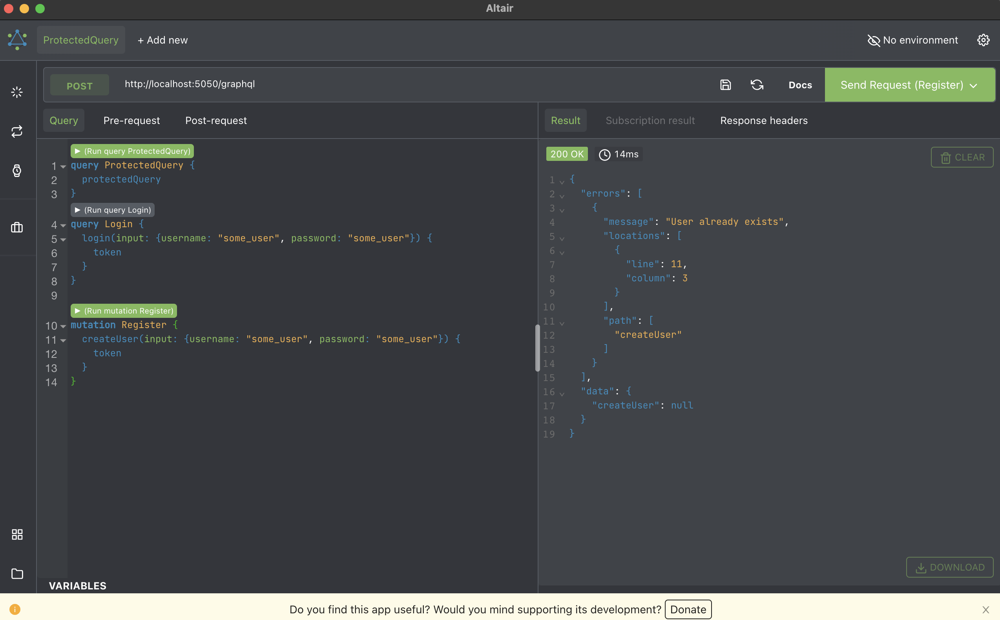

# Express + GraphQL Starter with JWT Authentication


1. After cloning the repo, create an .env file in the root path:
```bash
cp .env.example .env
```
---
2. Install the necessary npm packages:
```bash
npm install
```
---
3. Run the server in development mode:
```bash
npm run dev
```
---
4. Run the provided queries that are stored into `queries.graphql` file that is located. Install a graphql client (ex. Altair GraphQL Client) and paste the queries from the file.

*Dont forget to provide the authorization header for accessing the protected query*